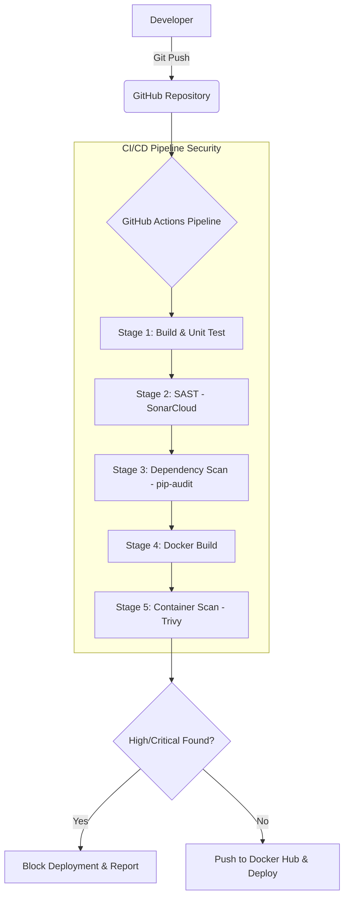

# Secure DevSecOps CI/CD Pipeline with Automated Security Testing

This project implements a complete DevSecOps pipeline for a Python-based web application. It demonstrates the "Shift Left" security philosophy by integrating security checks directly into the development lifecycle.

## 🚀 Features
- **Vulnerable Demo App**: A Flask application with intentional SQL Injection and XSS flaws.
- **SAST (Static Application Security Testing)**: Using **SonarCloud** to detect code-level vulnerabilities.
- **SCA (Software Composition Analysis)**: Using **pip-audit** to identify vulnerable dependencies in `requirements.txt`.
- **Container Security**: Using **Trivy** to scan Docker images for OS and library vulnerabilities before deployment.
- **Automated Blocking**: The pipeline fails if any CRITICAL or HIGH security risks are detected.

---

## 📐 Architecture Diagram

---

## 🛠️ Security Tools Integrated
1. **SonarCloud**: Analyzes source code for bugs, vulnerabilities, and security hotspots.
2. **pip-audit**: Checks for known vulnerabilities in Python packages listed in `requirements.txt`.
3. **Trivy**: A comprehensive scanner for vulnerabilities in container images.
4. **Docker**: Used for containerization, ensuring consistency and isolation.

---

## 📝 Viva Questions & Answers

### 1. What is DevSecOps?
DevSecOps is the practice of integrating security into every stage of the DevOps lifecycle. Instead of security being a final check before deployment, it is "shifted left" and automated.

### 2. What is SAST vs. DAST?
- **SAST (Static Analysis)**: Scans the source code without running it (e.g., SonarCloud).
- **DAST (Dynamic Analysis)**: Scans the running application by simulating attacks (e.g., OWASP ZAP). This project focuses on SAST, SCA, and Container Scanning.

### 3. Why did we use Trivy?
Trivy is a fast and easy-to-use security scanner for containers. It can detect vulnerabilities at the OS level (e.g., outdated Debian packages) and the application level (e.g., vulnerable Python libraries).

### 4. How does the pipeline block insecure code?
The tools (like Trivy and pip-audit) are configured to return a non-zero exit code (e.g., `exit-code: 1` in Trivy) when high-severity vulnerabilities are found. GitHub Actions detects this failure and stops the pipeline, preventing the "Push to Docker Hub" step.

---

## ⚙️ Setup Instructions
1. **Fork the Repo**: Push these files to your GitHub repository.
2. **SonarCloud**: Link your project to [SonarCloud](https://sonarcloud.io/) and add the `SONAR_TOKEN` to GitHub Secrets.
3. **Docker Hub**: Add `DOCKERHUB_USERNAME` and `DOCKERHUB_TOKEN` (Personal Access Token) to GitHub Secrets.
4. **Run**: Push any change to the `main` branch to trigger the pipeline.
